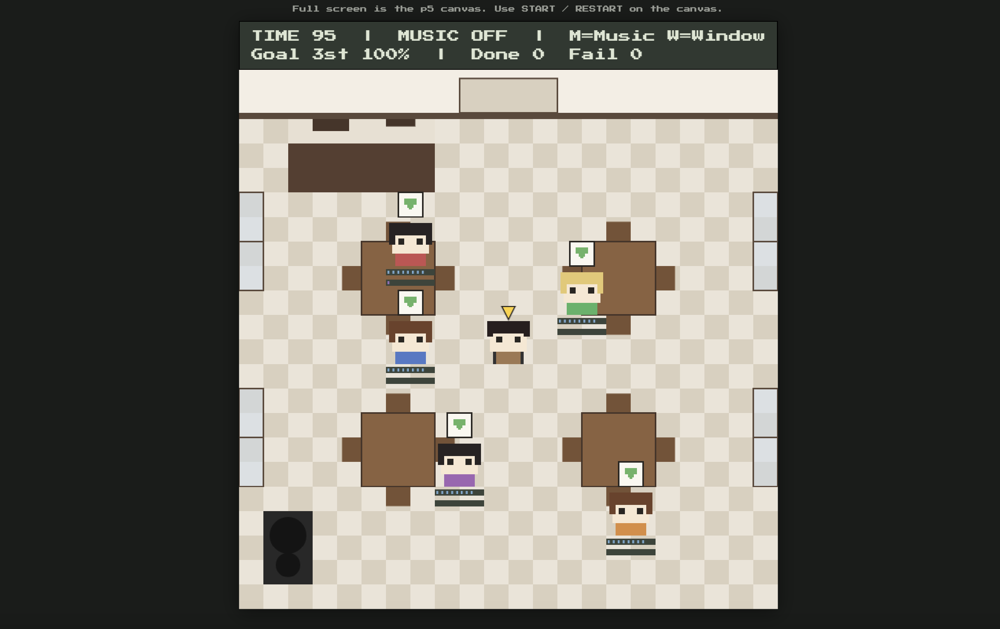

# Cafe Focus Manager

## 1. Student Information
Name : Jieun Lee (20254499)
Email : wldms47@kaist.ac.kr


## 2. Source Code Repository
https://github.com/eun47-ux/ID311-SPP-project1


## 3. Demo Video
https://youtu.be/z8CvN1aGxNo


## 4. Game Description

Cafe Focus Manager is a simulation game where the player acts as a cafe facilitator (manager).  
Instead of directly controlling students, the player manages the cafe environment and gives small interventions to help students maintain focus and complete their study goals.

The core idea of the game is that different people react differently to the same environment.  
Some students work better in quiet spaces, while others become more productive with louder music or stimulation. Some students benefit from fresh air when the window is opened, while others dislike it. Likewise, reminding or encouraging a student can motivate certain students, but distract or annoy others.

Each run assigns five fixed persona archetypes (different reaction vectors to remind / window / music) in a shuffled order, so the same “type” never appears twice in one round. The player has to read who benefits from what, instead of one global best setting.


### Main Gameplay Features

- Move around the cafe using arrow keys
- Click students to “remind” them and recover their focus
- Change cafe noise level near the speaker area
- Open windows near the side walls for ventilation
- Manage different student personalities and reactions
- Observe how different students react differently to the same intervention
- Prevent students from burning out before time runs out

### Persona-Based Reactions

Each student is one of five persona presets (factory-built), with different preferences and sensitivities.

Examples include:
- students who focus better with loud music
- students who lose focus in noisy environments
- students who benefit from ventilation and fresh air
- students who dislike open windows
- students who become motivated when reminded
- students who feel interrupted or stressed by reminders

Because of these different reactions, the player’s role is not to optimize for one ideal condition, but to balance the needs of multiple students at once.

### Win / Lose Conditions

The round runs up to the full **100 seconds** (`GAME_CONFIG.TOTAL_SECONDS` in `src/lib/cafeGame.js`), **unless** the outcome is already fully determined earlier.

- **Everyone’s fate is fixed** = each student is either at **100%** (trophy) or **failed** (focus hit zero). As soon as that is true for all five, the round **ends immediately**: **CLEAR** if at least **three** are at 100%, otherwise **GAME OVER**. (Example: at ~90s, three trophies and two failures → **CLEAR** right away.)
- **Before** that “all decided” moment: **GAME OVER** immediately if at least **three** students have failed (`LOSE_FAIL_COUNT`).
- **When** time reaches zero without an early exit: same rule as “all decided” using current counts — at least **three** at 100% → **CLEAR**, else **GAME OVER**.

Student progress gain is scaled for the round length (see `MATCH_LENGTH_SEC` / `PROGRESS_BASE_PER_SEC` in `src/lib/students.js`).


## 5. organization of your code.

The project separates game rules (`lib`) and rendering (`p5`).  
Following the course structure, gameplay logic and data are kept separate from visual drawing code to make the project easier to organize and modify later.


src/
  lib/
    cafeGame.js      — game rules, timer, win/lose, actions
    students.js      — Student class and Factory
    summary.js       — intervention tracking and reflection

  p5/
    gameSketch.js    — p5 instance, scenes, input handling
    palette.js       — colors and grid settings
    cafeWorldDraw.js — cafe environment drawing
    cafeHudDraw.js   — HUD rendering
    studentDraw.js   — student and player sprites

  App.svelte
  main.js


### Main Classes and Objects

The project is mainly structured around object-oriented classes.

- `Student` stores each student’s state such as:
  - `focus`
  - `progress`
  - `persona`
  - `failed`

  It also contains methods like:
  - `tick()`
  - `applyRemindFocusDelta()`
  - `applyWindowBoost()`

- `CafeGame` : manages one full game session, including:
  - timer
  - player actions
  - win / lose conditions
  - environment states

- `SessionSummary` : records player interventions and generates reflection messages at the end of the game.


- Factory Pattern
The project uses a Factory pattern for student creation.
Instead of creating students manually throughout the code, all students are generated through:


## 6. Highlights (Challenges and Design Decisions)

### 1. Difficulty Balancing

Balancing the game difficulty was one of the biggest challenges.

At first, study progress increased too quickly, so players could easily win without actively managing the cafe. Later, after reducing the progress speed, the opposite problem appeared: students lost focus too quickly and it became difficult to get enough students to finish before the timer ended.

The current version is intentionally designed to require active facilitation, but balancing focus decay, intervention effects, and progress speed required many iterations.


### 2. Persona-Based Reactions

A core design goal was making students react differently to the same intervention (remind / window / music pulse). Implementation-wise, each persona is a different tuple of deltas on the `Student` object, created through the factory + builder, and a full table of five never repeats within one round.


### 3. Preventing Repetitive Gameplay

Another challenge was preventing players from repeatedly using the same action without thinking.

To encourage observation and adaptation, the game includes systems where repeated direct interventions can eventually become less effective or even annoying for students.

The goal was to simulate the idea that facilitation requires understanding different people rather than endlessly applying the same solution.


### 4. Visual Direction Challenges

Finding the right visual direction was also difficult.

In the first prototype, the project mainly functioned as a dashboard-style simulation with minimal visuals. However, I wanted the game to feel more playful and game-like rather than purely informational.

To develop the visual style, I first created visual references and mood explorations using NanoBanana before implementing the final top-down cafe environment and pixel-style interactions.


### 5. System Complexity

Although the game appears simple, several systems interact simultaneously:
- focus decay
- study progress
- noise levels
- reminder reactions
- ventilation effects
- cooldown timing
- five persona presets (shuffled roster each run)

Making these systems feel understandable without becoming overwhelming required repeated tuning and simplification.


## 7. Acknowledgements

- Course materials and in-class examples (classes, `if`/`conditionals`, factory singleton + builder pattern from the tutorial notes)
- https://q5play.org/home/
- Google Fonts — Press Start 2P : for the retro UI typography.
- Reference images
  - 배경 레퍼런스 (generated with nanobanana2)  
  


## Running the project locally

```bash
npm install
npm run dev
```

Then open the URL shown in the terminal (often `http://localhost:8080`). For a production build:

```bash
npm run build
npm run start
```

The compiled assets are written to `public/build/`.
